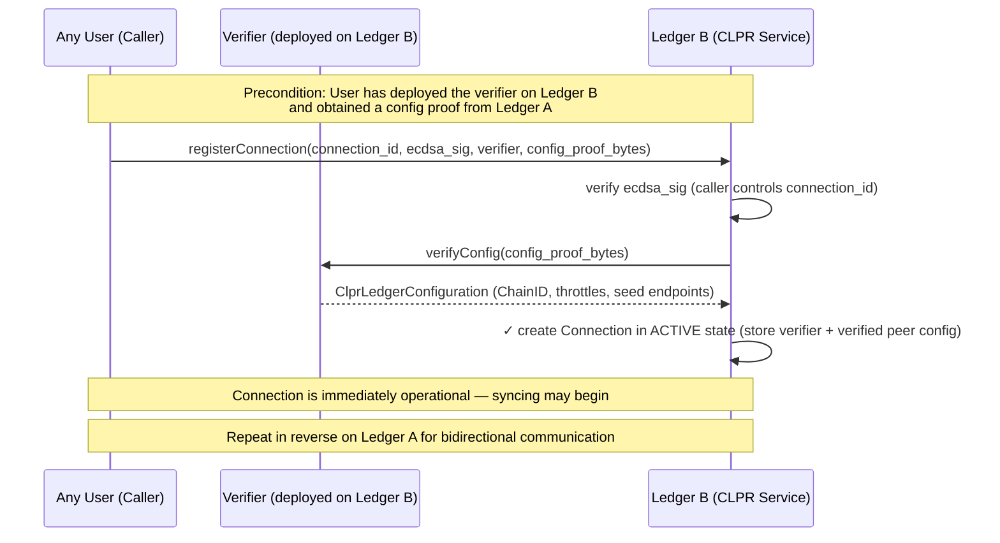
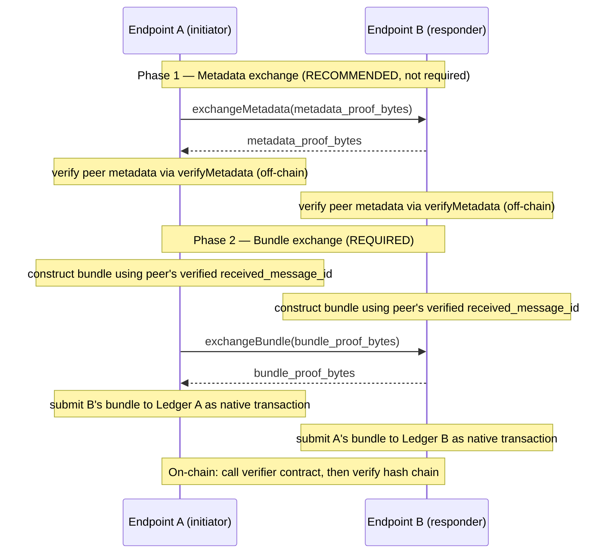
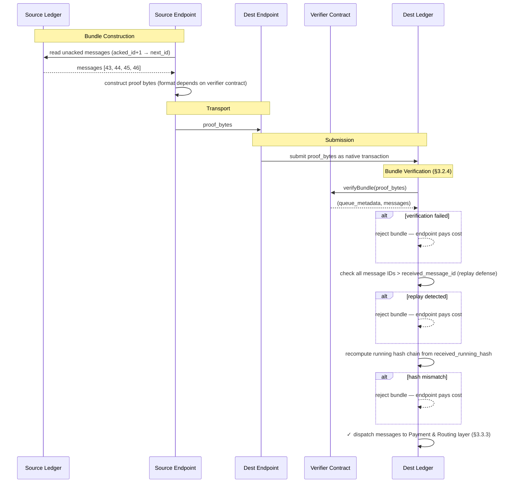
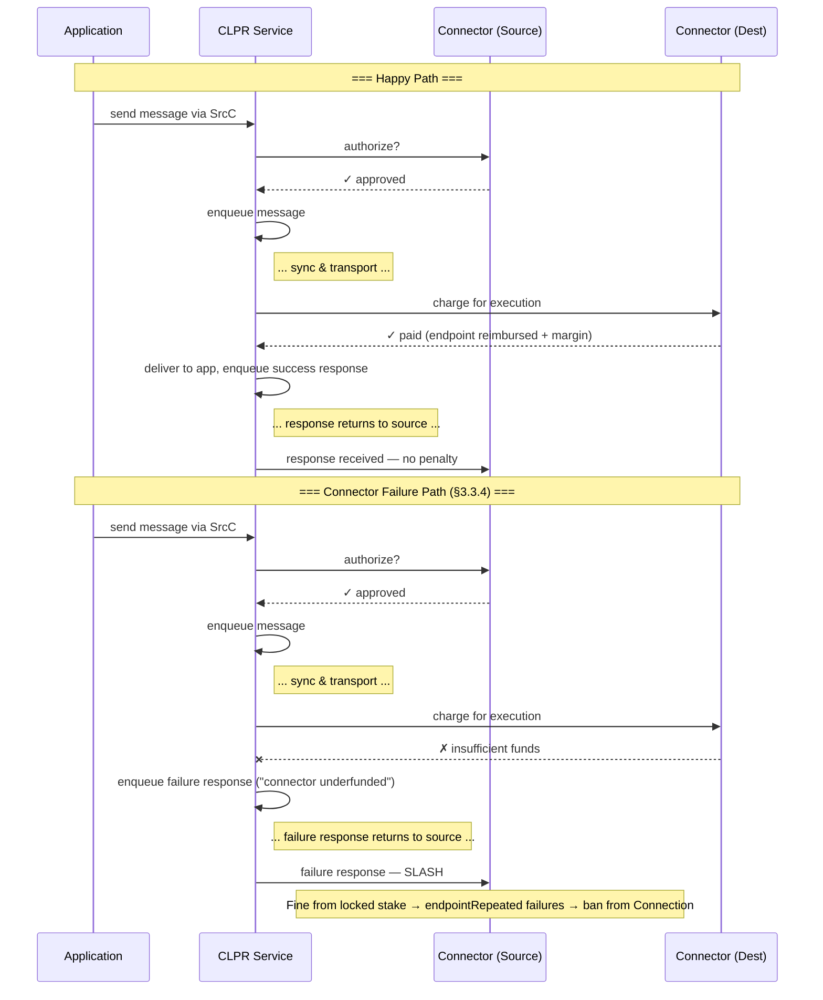

# 1. Executive Summary

CLPR (pronounced "Clipper") is a **Cross Ledger Protocol** that enables reliable, asynchronous message passing between
independent ledger networks. Unlike existing interledger solutions that weaken trust by introducing intermediary
consensus layers or federated bridges, CLPR relies on each ledger's native finality guarantees and verifiable state
proofs to achieve direct, ledger-to-ledger communication.

Messages are arbitrary byte payloads, making CLPR a general transport primitive suitable for cross-ledger smart contract
invocation, token movement, oracle data propagation, or application-specific messaging. When both participating ledgers
provide ABFT finality, CLPR inherits those guarantees and requires only a single honest endpoint node per ledger for
correct operation.

CLPR introduces no new token. All incentives and penalties are denominated in native ledger tokens and mediated through
**Connectors** — economic actors who front payment for message execution and are subject to slashing for misbehavior.

## Why CLPR

- **Preserves ABFT guarantees** — if both networks are ABFT, interledger communication inherits ABFT properties.
- **Eliminates intermediary trust** — ledgers rely on each other's verifiable state proofs rather than bridge
  validators.
- **Improves on existing solutions** — faster, cheaper, and/or more reliable than current interledger protocols.
- **Supports hybrid topologies** — enables communication between public and private Hiero networks and cross-ledger
  application orchestration.
- **Unlocks new business use cases** — positions Hedera competitively as the financial rails of tomorrow are being
  decided today.

---

# 2. Core Concepts and Terminology

CLPR connects one ledger to another without any intermediary nodes or networks. In a very real sense, *the ledgers are
communicating directly*. Users only have to trust the two ledgers they send messages between.

> 💡 **A note on Hedera and Hiero:** Throughout this document, "Hiero" refers to the open-source ledger software stack
(the node software, its APIs, and its state model). "Hedera" refers to the specific public network that runs Hiero. When
> describing behavior that applies to any network running Hiero (including private deployments), this document uses
"Hiero." When describing the public mainnet specifically, it uses "Hedera."

## 2.1 Common Terminology

- **Peer Ledger** — The "other" ledger this ledger is communicating with.
- **State Proof** — A cryptographic proof that a specific piece of data exists in a ledger's committed state and/or
  history. State proofs are the mechanism of trust — they allow one ledger to verify claims about another ledger's state
  without trusting any intermediary.
- **Endpoint** — A node responsible for periodically communicating with peer ledger endpoints to exchange configurations
  and messages.
- **CLPR Service** — The core business logic and state implementing CLPR on a particular ledger.
- **Connection** — An on-ledger entity representing a communication channel with a specific peer. Multiple Connections
  may exist between the same pair of ledgers.
- **Connector** — An economic entity that authorizes messages on the source ledger and pays for their execution on the
  destination ledger.
- **Message** — An arbitrary byte payload plus metadata representing a single unit of communication from one ledger to
  another.
- **Bundle** — An ordered batch of messages transmitted together between two ledgers, accompanied by a state proof.
- **Data Message** — A message carrying application-level content from one ledger to another. This is the primary unit
  of cross-ledger communication
- **Response Message** — A special message generated on the destination ledger and sent back to the source ledger,
  indicating success or a specific failure condition. Every Data Message produces exactly one Response Message in order.
- **Control Message** — A protocol-level message that manages the state of a Connection rather than carrying application
  data. Configuration updates are delivered as Control Messages.
- **Source Ledger / Destination Ledger** — The originating and receiving ledgers for a given message, respectively.
- **Configuration** — The chain ID and other metadata describing a ledger participating in CLPR.
- **HashSphere** — A private or permissioned network running Hiero software, typically deployed for enterprise or
  regulated use cases.

## 2.2 High-Level Message Flow

A good way to think about CLPR is by considering a simple message flow. In this flow, an application on the **source**
ledger will **initiate** a message transfer to a **destination** ledger. On the source ledger the application will call
the **CLPR Service** (which may be a native service on Hedera, or a smart contract on Ethereum or other ledgers). This
service maintains a queue of outgoing messages, and some information about which messages have been **acknowledged** as
having been received by the destination ledger.


Before adding a message to the end of the queue, the service will call a **connector** (chosen by the application) to
ask it whether it will be willing to facilitate payment on the destination ledger for this message. Connectors
represent economic actors. A connector has a presence on both the source and destination ledger. The connector on the
source is literally saying, "I am willing to pay for delivery and handling of this message on the destination ledger."
If the connector is willing, then the message is added to the outbound queue on the source ledger.

Once in the queue, **endpoints** on either the source or destination ledger initiate a connection with a peer endpoint.
When they do, they exchange a **bundle** of messages that have *not yet* been confirmed as received by the other ledger.
Among these messages are **responses** to formerly sent messages, along with **state proofs** to prove everything they
communicate with each other. It is through these proofs that cryptographic trust is established.

The endpoint on the destination that receives this bundle constructs a transaction native to its ledger (e.g., a HAPI
`Transaction` on Hiero or an RLP-encoded transaction on Ethereum) and submits the bundle, metadata, and proofs to its
ledger. Post-consensus, the transaction is handled by the CLPR Service on the destination. For each message, it checks
to make sure the connector exists and is able to pay. If so, it sets a max-gas limit and calls the application on the
destination. When this call returns, the connector is debited to pay for the gas used along with a small tax to be paid
to the destination node that submitted the transaction. A **response** message is created and queued to send back to the
source ledger.

On a subsequent **sync** between the source and destination, messages are exchanged, and the source sees the response
message. It records that this message has been received by updating the source ledger state. It then delivers the
response to the source application, and the entire message flow has completed.

Subsequent sections will dive into the details of how this is accomplished, including implementation notes for Hiero and
Ethereum networks, and security measures to prevent various attacks and misuses of CLPR.

## 2.3 Trust Model

An application using CLPR implicitly trusts a chain of components. Understanding this chain is essential for evaluating
whether a particular Connection is safe to use.

**The trust chain.** When an application on Ledger A sends a message through CLPR to an application on Ledger B, it
trusts:

1. **Its own ledger's consensus** — that Ledger A correctly orders and finalizes its transactions.
2. **The local CLPR Service** — that the CLPR Service implementation on Ledger A is correct and faithfully executes the
   protocol (enqueuing messages, processing bundles, enforcing ordering).
3. **The Connection and its verifier** — that the verifier contract on the Connection correctly validates proofs from
   Ledger B. A buggy or compromised verifier could accept fabricated proofs, causing the local ledger to process
   messages that Ledger B never sent.
4. **The remote ledger's consensus and CLPR Service** — that Ledger B correctly orders its transactions and that its
   CLPR Service faithfully executes the protocol.
5. **The remote application** — that the application on Ledger B behaves as expected when it receives the message and
   generates a response.

Most commonly, the same team deploys the application on both ledgers, so trust in the remote application is inherent.
When communicating with a third-party remote application, the usual smart contract audit and trust considerations apply.

**Permissionless connections.** Connection creation is permissionless — anyone can deploy a verifier contract and
register a Connection. This means a Connection's trustworthiness depends entirely on the verifier contract it uses.
Applications (or their users) must independently verify that the Connection they use is backed by a verifier that
correctly validates proofs from the intended peer ledger. A connection existing on a ledger does not mean the peer is
legitimate or the verifier is honest.

**Connectors.** Connectors are economic actors that front payment for message execution on the destination ledger. An
application chooses which Connector to use. A malicious Connector cannot forge or tamper with messages — the protocol's
state proofs prevent this — but it could refuse to pay, causing messages to fail on the destination. Applications should
choose Connectors with adequate funding and a track record of reliability.

**Endpoint availability.** The protocol's state proofs ensure that even with dishonest endpoints, no fabricated
messages can be accepted — but *availability* depends on at least one honest endpoint per side relaying bundles. If all
endpoints on one side are compromised, messages will be delayed or stalled but never forged.

## 2.4 Participant Roles

Every action in CLPR is ultimately initiated by a human or organization or agent acting in one of six roles.
Understanding these roles — and the trust chain that connects them — is essential for evaluating the security,
economics, and operational viability of a CLPR deployment. This section introduces the roles at a high level; detailed
operational procedures, actions, and risks for each role are described in [§4](#4-roles-and-operations).

### Trust Chain

CLPR's security model is a chain of vetting decisions. Each role evaluates the role below it before committing
economic value or user trust. The chain runs from the End User at the top (who bears the ultimate risk of a failed
cross-ledger interaction) to the Verifier Developer at the bottom (whose code is the cryptographic foundation of
every Connection).

```
End User
  └─ vets → Application Developer (application correctness, choice of Connection and Connector)
       └─ vets → Connector Operator (funding adequacy, reliability, choice of Connection)
            └─ vets → Connection (verifier contract correctness, peer ledger legitimacy)
                 └─ built by → Verifier Developer (proof system implementation)
                      └─ vets → Distributed Ledger (proof system and cryptography)
```

Orthogonally, two infrastructure roles support the entire system:

- **CLPR Service Admin** — emergency authority over all Connections on a CLPR Service instance. Can close
  any Connection but has no role in selecting verifiers, Connectors, or applications.
- **Endpoint Operator** — runs the infrastructure that moves bundles between ledgers. Serves all Connections
  on the ledger without choosing which ones.

**Economic participation is the primary motivator for trust verification.** Connector Operators evaluate verifiers
because their locked stake is at risk if the verifier is compromised. Application Developers evaluate Connectors
because their users' assets depend on reliable message delivery. End Users evaluate applications because their
funds are on the line. At every layer, the party with economic exposure performs the vetting — and the party
without economic exposure (notably the CLPR Service Admin) has the weakest incentive to actively monitor.

### Role Summary

| Role                      | Description                                                                                 | Trust Responsibility                                                                        | Economic Participation                                                                                        |
|---------------------------|---------------------------------------------------------------------------------------------|---------------------------------------------------------------------------------------------|---------------------------------------------------------------------------------------------------------------|
| **End User**              | Uses applications built on CLPR                                                             | Vets the application and its choices before use                                             | Bears application-level risk (locked assets, failed transactions)                                             |
| **Application Developer** | Builds and deploys cross-ledger applications on both ledgers                                | Vets Connections and Connectors before integrating                                          | Pays per-message fees to Connectors                                                                           |
| **Connector Operator**    | Funds and operates a Connector on one or more Connections; may also create Connections      | Vets verifier implementations before bonding to a Connection                                | Primary economic facilitator — posts balance and locked stake, pays for remote execution, subject to slashing |
| **Verifier Developer**    | Builds, audits, and publishes verifier contract implementations for a specific proof system | Responsible for the correctness and security of the verification logic                      | None in-protocol — compensated externally                                                                     |
| **Endpoint Operator**     | Runs a node that syncs with peer endpoints and submits bundles                              | Trusts the local CLPR Service implementation and the Connections it serves                  | Earns margin from Connector reimbursement; fronts transaction costs; subject to slashing                      |
| **CLPR Service Admin**    | Governs a CLPR Service instance                                                             | Emergency authority — acts when Connections are compromised or the protocol is under attack | None — no fees, no revenue, no bond                                                                           |

### Role Descriptions

**End User.** The person or entity that interacts with applications built on CLPR. They do not interact with the
CLPR protocol directly — they use a cross-ledger application (an asset transfer service, a cross-chain DEX) that
uses CLPR as its transport layer. End Users are permissionless and need only an account on at least one of the
ledgers involved.

**Application Developer.** Builds and deploys smart contracts on both ledgers that use CLPR as a transport layer.
They are the primary consumer of the CLPR protocol — choosing which Connections and Connectors to integrate with,
designing the message format, handling responses, and building the user-facing interface. Application Developers
are permissionless.

**Connector Operator.** The primary economic facilitator — the role with the most direct protocol-level financial
exposure. They register a Connector on a Connection, post a balance and a locked stake, and authorize messages from
applications. Connector Operators are the natural party to create Connections because their locked stake is directly
at risk if the verifier is compromised.

**Verifier Developer.** Builds, audits, and publishes verifier contract implementations for a specific proof system.
They are an entirely off-chain role with no protocol-level identity and no direct economic participation. Yet they
are arguably the most trust-critical role: every Connection depends on a verifier, and every verifier was built by
someone.

**Endpoint Operator.** Runs a node that participates in the CLPR sync protocol — exchanging bundles with peer
endpoints, constructing state proofs, and submitting received bundles to the local ledger. On Hiero, every consensus
node is automatically an endpoint. On Ethereum and other permissionless ledgers, endpoints register explicitly and
post a bond.

**CLPR Service Admin.** Governs a CLPR Service instance with broad but exclusively protective power — they can
configure, close, and redact, but cannot create Connections, register Connectors, or participate in
economic activity. On Hedera, this is the governing council. On Ethereum, it is whoever controls the CLPR Service
contract's admin role.

---

# 3. Architecture

CLPR is organized into four distinct layers:

| **Layer**                   | **Responsibility**                                                                                                  | **Key Abstractions**                                                     | **Capability**                                                                                                                     |
|-----------------------------|---------------------------------------------------------------------------------------------------------------------|--------------------------------------------------------------------------|------------------------------------------------------------------------------------------------------------------------------------|
| **Network Layer**           | Physical data transport between ledger endpoints; handshaking, trust updates, throttle negotiation                  | Connection, endpoint, verifier contracts, gRPC channels, encoding format | Two ledgers can connect. Misbehaving endpoints are locally detectable and punishable.                                              |
| **Messaging Layer**         | Ordered, reliable, state-proven message queuing and delivery between ledgers                                        | Message queues, bundles, running hashes, state proofs for messages       | Two ledgers can pass messages between each other.                                                                                  |
| **Payment & Routing Layer** | Connector authorization and payment, message dispatch to applications, response generation, and penalty enforcement | Connector contracts, application interfaces, slashing mechanisms         | Messages are validated against Connectors, Connectors reimburse nodes, and misbehaving Connectors are punishable.                  |
| **Application Layer**       | User-facing distributed applications built on CLPR                                                                  | Cross-ledger smart contract calls, asset management, atomic swaps        | Applications can send messages between each other across ledgers by specifying the destination ledger, application, and connector. |

Network communication uses gRPC and protobuf. All messages and protocol types are encoded in protobuf. State proofs are
verified by **verifier contracts** — external smart contracts registered on each Connection that know how to verify
proofs from a specific source ledger. CLPR itself is proof-system-agnostic; all cryptographic verification is delegated
to verifier contracts (see [§3.1.5](#315-verifier-contracts)).

> 💡**Encoding format under review.** Jasper is examining XDR as an alternative that may be more gas-efficient on
> Ethereum than protobuf.

---

## 3.1 Network Layer

The network layer defines the CLPR Service and the state it maintains ([§3.1.0](#310-the-clpr-service)), how ledgers
identify themselves ([§3.1.1](#311-ledger-identity-and-configuration)), how the endpoint roster is managed
([§3.1.2](#312-endpoint-roster)), how connections are formed and maintained
([§3.1.3](#313-establishing-and-updating-connections)), how endpoints communicate
([§3.1.4](#314-endpoint-communication-protocol)), how verifier contracts provide the underlying trust mechanism
([§3.1.5](#315-verifier-contracts)), and local misbehavior detection mechanisms that protect the
protocol ([§3.1.6](#316-misbehavior-detection)).

### 3.1.0 The CLPR Service

The **CLPR Service** is the core on-ledger component that implements the CLPR protocol. It is the single source of truth
for all CLPR state on a given ledger, and it contains all protocol logic — message routing, payment processing, proof
verification, misbehavior enforcement, and fund custody. On Hiero networks it is a native service built into the node
software; on Ethereum it is a smart contract deployed on-chain.


**State owned by the CLPR Service:**

- **Local configuration** — The configuration describing this ledger: its `ChainID` and throttle parameters.
  There is exactly one local configuration per CLPR Service instance.
- **Connections** — Each Connection is keyed by its **Connection ID** (see
  [§3.1.3](#313-establishing-and-updating-connections) for how this ID is derived). Multiple Connections may target the
  same peer CLPR Service instance — for example, with different verifiers operating at different commitment levels. Each
  connection holds the peer's `ChainID` and `ClprServiceAddress`, the peer's last-known configuration timestamp, the
  verifier contract used to verify inbound proofs, and all message queue metadata.
- **Locked funds** — Balances posted by endpoints (bonds held against misbehavior) and connectors (funds held to pay for
  message execution on arrival, and bonds held against misbehavior). The CLPR Service is the custodian of these funds
  and the sole authority for releasing or slashing them.

The CLPR Service holds all protocol logic that acts on its state — proof verification delegation, bundle processing,
application dispatch, connector charging, endpoint reimbursement, misbehavior enforcement, etc.

> 💡 **Hiero:** The CLPR Service is a native Hedera service, co-located with the node software. State is stored in the
> Merkle state tree alongside other Hiero state (accounts, tokens, etc.), making it directly provable via Hiero state
> proofs.

> 💡 **Ethereum:** The CLPR Service is a smart contract. All state it maintains lives in contract storage and is
> provable via Ethereum state proofs (`eth_getProof`). The contract is the authoritative registry for Connections,
> endpoint rosters, Connectors, and all locked funds on the Ethereum side.

### 3.1.1 Ledger Identity and Configuration

Each ledger participating in CLPR maintains a **configuration** describing its identity and communication parameters.
The primary fields in the configuration are: `ChainID`, `Timestamp`, `Throttles`, and `Seed Endpoints`
(up to 10 peer bootstrap endpoints for gossip-based discovery — see [§3.1.2](#312-endpoint-roster)).

The *local configuration* describes *this* ledger.

**Authority.** The local configuration may only be updated by the admin of the CLPR Service — on Hiero this is a
privileged system operation. On Ethereum this is a call from the contract's designated admin account.

---

**ChainID**

Every ledger is identified by its `ChainID`, which is a
[CAIP-2](https://github.com/ChainAgnostic/CAIPs/blob/main/CAIPs/caip-2.md) chain identifier string of the form
`namespace:reference`. This identifies the chain but does **not** uniquely identify a CLPR Service instance — multiple
CLPR Service deployments may exist on the same chain (e.g., two competing CLPR Service contracts on Ethereum, both
claiming `eip155:1`).

A peer CLPR Service instance is identified by the compound key **`(ChainID, ClprServiceAddress)`**, where
`ClprServiceAddress` is the on-ledger address of the peer's CLPR Service (a contract address on EVM chains, a well-known
constant on Hiero where the CLPR Service is native).

**Examples:**

| Network                      | ChainID                |
|------------------------------|------------------------|
| Hedera Mainnet               | `hedera:mainnet`       |
| Hedera Testnet               | `hedera:testnet`       |
| Ethereum Mainnet             | `eip155:1`             |
| Ethereum Sepolia             | `eip155:11155111`      |
| Private / HashSphere network | `hashsphere:acme-prod` |

For public networks, the namespace and reference SHOULD correspond to a registered CAIP-2 namespace. For private or
permissioned networks (e.g., HashSphere deployments), operators MAY self-assign a `ChainID` using an unregistered
namespace; uniqueness within the deployment is the operator's responsibility.

> ‼️ Anyone could maliciously construct a ledger configuration using any `ChainID` of their choosing. Because connection
> creation is permissionless (see [§3.1.3](#313-establishing-and-updating-connections)), applications that use CLPR
> **must** independently verify that they are interacting with the correct connection for their intended peer ledger.
> A connection existing on a ledger does not mean the peer is legitimate.

---

**Timestamp**

Each configuration carries a `timestamp` set to the consensus time of the transaction that last modified the
configuration. It is a monotonically increasing value used to determine which of two configurations is more recent. Any
configuration update — including changes to throttles or seed endpoints — advances the timestamp.

---

**Throttles and Acceptance Criteria**

Each ledger specifies the following capacity limits in its configuration:

`MaxMessagesPerBundle` is a hard capability limit. It reflects the maximum number of messages that can be included in a
single bundle without exceeding **this** ledger's gas or execution budget when receiving bundles. Sending endpoints
MUST respect this limit.

`MaxMessagePayloadBytes` is the maximum size of a single message payload that **this** ledger will accept when receiving
messages. The source ledger's CLPR Service MUST reject any message whose payload exceeds the destination's advertised
limit. See [§3.2.5](#325-bundle-size-and-throughput-limits) for the full enforcement rules.

`MaxGasPerMessage` caps the computation budget for processing a single message on **this** ledger. This bounds the
worst-case execution time per message and prevents a single expensive message from monopolizing block resources.

`MaxSyncBytes` is the maximum total size of a bundle exchange payload (proof bytes, queue metadata, and
message bundle combined) that **this** ledger will accept from a peer endpoint. This caps the data an
endpoint must receive and process at the gRPC level before submitting it as a transaction. Endpoints MUST
reject bundle payloads exceeding this limit. This limit also applies to Metadata proofs. This
value MUST be greater than `MaxMessagePayloadBytes` plus the protocol overhead (proof bytes, queue metadata,
and message framing) required to deliver a single message. If `MaxSyncBytes` is set too low, the Connection
can deadlock — the next message to send may be larger than the bundle payload can carry, halting progress
indefinitely.

`MaxQueueDepth` is the maximum number of unacknowledged messages allowed in the outbound queue for a single connection.
When the queue is full, new messages are rejected until the peer catches up. This provides natural backpressure when
one ledger is faster than the other and prevents unbounded state growth from accumulating undelivered messages.

`MaxSyncsPerSec` is a connection-level aggregate rate limit on inbound **sync cycles**. A sync cycle
consists of an optional metadata exchange plus a required bundle exchange
([§3.1.4](#314-endpoint-communication-protocol)); one sync cycle counts as one rate-limit unit regardless
of whether the metadata exchange was performed. This represents the total number of sync cycles the
receiving ledger will accept per second across **all** peer endpoints for a given connection. Each peer
endpoint's fair share is `MaxSyncsPerSec / num_peer_endpoints` — derived from the peer's endpoint roster,
which is known to the receiving ledger. A peer endpoint that exceeds its fair share (with a tolerance band
of ~10% to account for timing variance) is individually at fault.

**Enforcement.** Each local endpoint independently tracks inbound sync frequency per remote endpoint. When
a specific peer endpoint exceeds its fair share, the local endpoint **shuns** it — refusing further syncs
from that endpoint. Only the misbehaving peer endpoint is shunned; the Connection and all other peer
endpoints are unaffected.

**Motivation.** Beyond abuse prevention, this limit reduces wasteful duplication. On Ethereum, for example,
multiple source endpoints receiving the same sync simultaneously may each independently construct and submit
a transaction to the mempool, incurring gas costs even if duplicates are rejected. A sending ledger that
distributes its sync budget across endpoints minimizes this overhead.

**Additional Defense.** Endpoints on a ledger may also choose to implement a short random delay between when a bundle
is received and when that endpoint submits the bundle to its ledger. This defends against a simultaneous burst attack
where a single source endpoint floods large numbers of destination endpoints at the same time. By introducing a small
random delay, destination endpoints **may** observe through gossip some other endpoint has already submitted the bundle
and therefore avoid submitting a duplicate.

**Protocol strictness.** All limits in the configuration are published so that both sides know the rules. A peer that
exceeds any published limit — whether on payload size, bundle size, sync payload size, or sync frequency — is
committing a measurable, attributable violation. The receiving side MUST reject the offending submission and MAY count
repeated violations toward local misbehavior thresholds ([§3.1.6](#316-misbehavior-detection)). A peer should
never be penalized for reasons it cannot determine from the published configuration. Conversely, any submission that
does not conform to the protocol specification (unknown fields, malformed metadata, unexpected message types) MUST be
rejected outright. The CLPR protocol is strict: implementations MUST NOT silently ignore unrecognized data.

### 3.1.2 Endpoint Roster

The endpoint roster is the set of endpoints a ledger exposes for CLPR communication with a specific peer. It is
maintained as separate ledger state, indexed by connection, and is not embedded in the configuration. This keeps
configuration updates lightweight — a ledger with thousands of endpoints does not need to re-transmit the entire roster
whenever an unrelated configuration field changes.

An endpoint has:

- **Service Endpoint** — The IP address and port of the endpoint. Optional; may be omitted for private networks that
  only initiate outbound syncs.
- **Signing Key** — An ECDSA_secp256k1 public key used for payload signing and verification.
- **Account ID** — The on-ledger account associated with this endpoint node. A byte array whose length depends on the
  ledger (e.g., 20 bytes for Hiero and Ethereum, 32 bytes for Solana).

**Discovery.** Peer endpoint discovery is handled entirely off-chain via gossip between endpoints. Each ledger's
configuration includes up to 10 **seed endpoints** (in `ClprLedgerConfiguration`) that provide initial
bootstrap connectivity for new endpoints. Seed endpoints are propagated to peers via the normal `ConfigUpdate`
Control Message mechanism. Once an endpoint has connected to any peer, it uses the `discoverEndpoints` gRPC RPC
to learn about additional peers.

**No on-chain peer roster.** Peer endpoint data is NOT stored in on-ledger state. Each endpoint maintains its
own local, ephemeral view of known peers. This avoids the O(N × M) gas cost of propagating endpoint changes
across N endpoints and M connections.

**Per-endpoint throttle.** The CLPR Service enforces a per-endpoint submission rate limit on `submitBundle`.
Each registered endpoint gets `1 / num_registered_endpoints` of the total bundle submission capacity. Excess
submissions are rejected and the submitter is charged. This incentivizes endpoints to avoid duplicate submissions
(e.g., by introducing a small random delay before submitting).

**Reciprocity.** Endpoints prefer to sync with peers that reciprocate by providing messages in return. An
endpoint that only requests messages without providing any will be deprioritized by its peers. This naturally
converges on efficient pairings where both sides do useful work, and cannot be faked — providing a valid
bundle with messages requires having actual messages to send.

**How local endpoints are established** varies by ledger type:

> 💡 **Hiero:** Every consensus node is automatically a CLPR endpoint. When CLPR is first enabled, the node software
> reads the active roster and registers all nodes as local endpoints. From that point forward, any roster change — a
> node joining, leaving, or upgrading — automatically updates the local endpoint set. No manual management is required.
> On Hiero, misbehavior penalties ([§3.1.6](#316-misbehavior-detection)) are enforced through the node's
> existing account — a misbehaving endpoint node's account can be slashed, or the node can be removed from the active
> roster by governance action. No separate CLPR-specific bond is required because Hedera consensus nodes are
> permissioned, but this may change in the future, especially for Hiero nodes.

> 💡 **Ethereum:** There are no local endpoints by default. Validators opt in as CLPR endpoints by calling a
> registration method on the CLPR Service contract and posting a bond (ETH locked in escrow against misbehavior). They
> can remove themselves by calling a deregistration method. There is no automatic synchronization with the Ethereum
> validator set — endpoint participation is explicitly managed through contract calls.

> ‼️ **Sybil resistance.** On ledgers where endpoint registration is open (e.g., Ethereum), the endpoint bond must be
> large enough to make Sybil attacks economically infeasible. An attacker who registers many cheap endpoints can eclipse
> honest endpoints — controlling which bundles get submitted and enabling censorship or selective delay. The bond size
> should be calibrated so that controlling a majority of endpoints costs more than the value that could be extracted
> through censorship. Additionally, peer endpoint selection during sync should incorporate randomization to prevent
> persistent pairing, and endpoint reputation scoring can help honest endpoints preferentially select reliable
> peers. On Hiero, where all consensus nodes are automatically endpoints, Sybil resistance is inherited from the
> network's stake-weighted consensus.

### 3.1.3 Establishing and Updating Connections

Connection creation is **permissionless**. Anyone can register a new connection by deploying a verifier contract,
obtaining a configuration proof from the peer ledger, and calling `registerConnection`. The verifier is fixed for
the lifetime of the connection and cannot be changed. The CLPR Service admin retains the power to **close**
any connection at any time (see below).



**Connection ID.** Each Connection is identified by a **Connection ID** that is the same on both ledgers. The registrant
generates an ECDSA_secp256k1 keypair and derives the Connection ID from the public key (e.g., `keccak256(pubkey)`).
Registration on each ledger requires a signature from this key, proving the registrant controls the identity. Because
the Connection ID is deterministic from the keypair, the registrant can register on both ledgers independently, in any
order, without a pairing ceremony. An attacker who observes a registration on one ledger cannot front-run registration
on the other because they do not hold the private key. ECDSA_secp256k1 is chosen for universal platform support:
Ethereum has the `ecrecover` precompile, Solana has the secp256k1 program, and Hiero supports it natively.

**Registration flow.** The caller submits a `registerConnection` call specifying:

1. The **Connection ID** and an **ECDSA_secp256k1 signature** over the registration data, proving the
   caller controls the identity keypair.
2. The address of a **verifier contract** already deployed on the local ledger. The verifier is fixed for the
   lifetime of the Connection and cannot be changed.
3. **Configuration proof bytes** (`config_proof_bytes`) — an opaque proof from the peer ledger.

The CLPR Service verifies the ECDSA signature (confirming the caller controls the Connection ID), calls
`verifyConfig(config_proof_bytes)` on the specified verifier to obtain the peer's verified configuration
(ChainID, service address, throttles, seed endpoints, timestamp), stores the Connection with its verified peer
config, and stores the verifier contract address and its code fingerprint. The Connection is immediately `ACTIVE`.

Subsequent configuration changes from the peer are propagated via the messaging layer's `ConfigUpdate` Control
Message mechanism ([§3.2.2](#322-message-storage)), which ensures total ordering with data messages.

**Multiple Connections to the same peer.** Because Connections are keyed by Connection ID (not by the peer's identity),
multiple Connections may exist between the same pair of ledgers. This is useful when a peer ledger supports multiple
commitment levels in its state proofs — for example, Ethereum offers `latest`, `safe`, and `finalized` block
confirmations. Each Connection uses a different verifier tuned to a specific commitment level, giving applications a
choice between lower latency and stronger finality guarantees. Each Connection has its own independent queue. See 
[§3.4](#34-application-layer) for application-layer patterns that leverage this.

**Connection lifecycle.** A Connection has five states:

- **ACTIVE** — Normal operation. Messages are enqueued, syncs occur, bundles are processed. This is the
  initial state after successful registration.
- **PAUSED** — The Connection is temporarily suspended due to a response ordering violation detected
  during inbound bundle processing ([§3.2.7](#327-response-ordering-and-correlation)). No new outbound
  messages are accepted (`sendMessage` rejected). Inbound bundles containing out-of-order responses are
  rejected — nothing is dispatched, no acknowledgements updated, no hash chain advanced. The bundle is
  simply unprocessable. Syncs continue in both directions. Auto-resumes to ACTIVE when the peer produces
  a bundle with correctly ordered responses, which is then processed normally. The admin MAY close a PAUSED
  Connection (`closeConnection` transitions it to CLOSING). While PAUSED+CLOSING, bundles with out-of-order
  responses are still rejected; once the peer fixes the ordering, bundles are processed with
  `CONNECTION_CLOSED` responses (since the Connection is CLOSING), and queues drain normally through
  DRAINED → CLOSED.
- **CLOSING** — The admin has called `closeConnection`. No new messages from applications. In-flight
  messages received on a closed connection are returned with `CONNECTION_CLOSED` without charging the connector or
  being handled by an application. Acknowledgments flow and queues drain. The Connection's state is propagated
  to the peer via `ClprQueueMetadata` during the next sync, transitioning the peer's side to CLOSING as well.
- **DRAINED** — The peer has acknowledged all outbound messages. The Connection remains in DRAINED until
  both sides reach DRAINED, at which point both transition to CLOSED.
- **CLOSED** — Terminal state. All processing stops. Endpoints stop syncing for this Connection.

**State transitions:**

- (new) → ACTIVE (`registerConnection` succeeds)
- ACTIVE → PAUSED (auto: response ordering violation detected)
- ACTIVE → CLOSING (admin calls `closeConnection`)
- PAUSED → ACTIVE (auto: peer fixes ordering — if admin hasn't closed)
- PAUSED → CLOSING (admin calls `closeConnection` — Connection drains once peer fixes ordering)
- CLOSING → DRAINED (auto: peer has acknowledged all outbound messages)
- DRAINED → CLOSED (auto: both sides are DRAINED)

**Who can close.** Only the **CLPR Service admin** (governing council on Hiero, contract governance on
Ethereum) can close any Connection. `closeConnection` is valid from ACTIVE or PAUSED status. PAUSED is
auto-triggered and auto-resolved (back to ACTIVE) if the admin has not closed; if the admin closes a
PAUSED Connection, it transitions to CLOSING and drains once the peer fixes the ordering. Connections
have no per-connection admin authority — the registrant has no special privileges after creation. The
ECDSA keypair used for registration exists solely to coordinate cross-ledger registration and has no
further protocol role.

**Verifier immutability.** The verifier contract is fixed at registration time and cannot be changed. If the source
ledger upgrades its proof format, a new Connection must be registered with a new verifier. This simplifies the trust
model: applications can evaluate a Connection's verifier once and know it will not change underneath them.

### 3.1.4 Endpoint Communication Protocol

Every CLPR endpoint runs a gRPC server that implements the CLPR Endpoint API. A **sync cycle** between two endpoints
consists of up to two calls: an optional metadata exchange followed by a required bundle exchange. Together, these two
calls form the complete interledger data exchange at the network layer.


A sync cycle is initiated by one endpoint selecting a peer endpoint from the Connection's peer roster and opening a gRPC
connection to it. The two calls proceed as follows:

**`exchangeMetadata` (RECOMMENDED).** The initiating endpoint calls the peer, sending **metadata proof bytes** — a
lightweight state proof covering only its queue metadata (message IDs and running hashes, as defined
in [§3.2.1](#321-message-queue-metadata)). The responder returns its own metadata proof bytes. Each side verifies the
received proof locally via `verifyMetadata` on the Connection's verifier contract
([§3.1.5](#315-verifier-contracts)), obtaining the peer's authenticated queue state. Both sides now know the peer's
latest `received_message_id` and can construct minimal bundles containing only truly unacked messages.

This call is optional. Endpoints that skip it fall back to using the last on-chain `acked_message_id`, which may lag
behind reality. The result is duplicate messages in the bundle that the receiver's replay defense will filter — harmless
to correctness but wasteful of bandwidth and transaction fees. The metadata exchange is RECOMMENDED for production
endpoints to maximize throughput under bundle size throttles.

**`exchangeBundle` (REQUIRED).** The initiator calls the peer, sending **bundle proof bytes**. The responder returns
its own bundle proof bytes. Each side verifies the received proof locally via `verifyBundle` on the Connection's
verifier contract, then submits the verified bundle to its own ledger as a native transaction. The bundle proof is
self-contained — `verifyBundle` returns both queue metadata (for on-chain ACK processing) and messages. This call
works correctly with or without a preceding `exchangeMetadata`.

**Proof structure.** Both calls carry **opaque proof bytes** that will be passed to the Connection's verifier contract
on the receiving ledger. Metadata proofs are lightweight (queue metadata only); bundle proofs are heavier (queue
metadata plus message payloads). What the proof bytes contain internally — state roots, Merkle paths, ZK proofs, TSS
signatures, BLS aggregate signatures — is entirely up to the verifier contract. CLPR does not interpret or constrain the
proof format.

> 💡 **Important:** Endpoints **MUST** verify bundle proofs before submitting transactions to their own ledger. On
> Hiero and Ethereum, this is done by executing the verifier contract *locally* before submitting the transaction. This
> must be done, otherwise the endpoint will have to pay for invalid payloads that fail verification post-consensus.

The bundle exchange carries:

- **Proof bytes** — Opaque bytes that the receiving ledger's verifier contract knows how to interpret. Contains
  whatever the verifier needs to extract and verify the queue metadata and messages.
- **Queue metadata** — Current message IDs and running hashes (defined in [§3.2.1](#321-message-queue-metadata)), so
  each side knows what the other has sent and received. Extracted and verified by the verifier contract.
- **Message bundles** — Any pending messages that the peer has not yet acknowledged. Extracted and verified by the
  verifier contract.

The queue metadata exchange is the preferred mechanism by which acknowledgements are communicated — the peer's reported
`received_message_id` becomes the sender's `acked_message_id`, enabling deletion of acknowledged response messages and
ordering verification for initiating messages (see [§3.2.6](#326-message-lifecycle-and-redaction)
and [§3.2.7](#327-response-ordering-and-correlation)). The metadata is also included as part of the bundle proof.



**Private networks.** Not all ledgers need to expose their endpoints publicly. A ledger may choose to keep its endpoint
addresses private by omitting service endpoints from its endpoint roster entries. In this case, the private ledger's
endpoints are the only ones that can initiate sync calls — since the peer ledger does not know their addresses, it
cannot reach them. This is useful for enterprise or regulated networks (e.g., a HashSphere) that need to communicate
with a public ledger like Hedera or Ethereum without exposing any network infrastructure.

When a ledger is private, its endpoints are responsible for initiating communication with the peer ledger.

### 3.1.5 Verifier Contracts

CLPR is **proof-system-agnostic** — all cryptographic verification is delegated to verifier contracts, and the protocol
never interprets proof bytes directly. A verifier contract is a smart contract (on EVM chains) or a system contract /
native callback (on Hiero) that implements the following methods:

- **`verifyConfig(bytes) → ClprLedgerConfiguration`** — Accepts opaque proof bytes, performs whatever cryptographic
  verification is appropriate for the source ledger, and returns a verified configuration. Used during
  `registerConnection` to verify the peer's configuration at registration time
  ([§3.1.3](#313-establishing-and-updating-connections)).
- **`verifyBundle(bytes) → (ClprQueueMetadata, ClprMessagePayload[])`** — Accepts opaque proof bytes, performs
  verification, and returns verified queue metadata and messages. Used during bundle processing
  ([§3.2.4](#324-bundle-verification)).
- **`verifyMetadata(bytes) → ClprQueueMetadata`** — Accepts opaque metadata proof bytes, performs cryptographic
  verification appropriate for the source ledger, and returns verified queue metadata. Used during the optional
  metadata exchange phase of a sync cycle ([§3.1.4](#314-endpoint-communication-protocol)) so each endpoint can learn
  the peer's authenticated queue state before constructing its bundle. This is a lightweight proof covering only the
  queue metadata fields, not message payloads. Verifier implementations SHOULD support this method; endpoints that call
  `exchangeMetadata` require it.

What happens inside the verifier contract is entirely its own concern. A verifier for Hiero might check TSS signatures
and Merkle paths. A verifier for Ethereum might validate BLS aggregate signatures from the sync committee or verify a
ZK proof that wraps the Ethereum consensus attestation. A verifier for a new chain might use an entirely novel proof
system. CLPR does not constrain or even inspect the proof format — it only requires that the verifier return structured,
verified data.

**Trust model.** CLPR trusts the verifier contract's output — if the verifier lies, the Connection is compromised.
The verifier is specified by the connection registrant at creation time and is fixed for the Connection's lifetime
(see [§2.3](#23-trust-model) and [§3.1.3](#313-establishing-and-updating-connections)). Applications must independently
evaluate the verifier contract before using a Connection. CLPR independently verifies running hash chain integrity,
message ID sequencing, and response ordering ([§3.2.4](#324-bundle-verification)) — these checks catch verifier bugs
but not a compromised verifier, which would return fabricated data with matching hashes.

**Finality and reorg risk.** For ledgers without instant finality (e.g., Ethereum), the commitment level at which the
verifier accepts proofs determines the reorg risk. A verifier that accepts proofs at `latest` commitment level is
vulnerable to chain reorganizations: a message may be processed on the destination, and then the source block is
reverted, producing a "phantom message" that never actually existed on the source. For token bridges, this enables
double-spending. The commitment level is a property of the verifier implementation — CLPR does not enforce or inspect
it. Source ledger admins choosing which verifier to endorse, and applications choosing which Connections to use, must
evaluate the verifier's commitment level relative to their risk tolerance. For high-value or irreversible operations,
only verifiers that enforce `finalized` commitment (or equivalent) should be used. Ledgers with ABFT finality (e.g.,
Hiero) do not have this concern — finality is instant and reorgs are not possible under honest supermajority.

**Adding new chains.** Adding CLPR support for a new ledger does not require changes to the CLPR protocol or to existing
implementations on other ledgers. It requires: (1) deploying a CLPR Service on the new ledger, (2) building a verifier
contract that can verify that ledger's proofs, (3) publishing the verifier implementation for peer ledger users to
evaluate, and (4) anyone deploying the verifier on a target peer ledger and registering a Connection. The source
ledger's ecosystem is responsible for building and maintaining its verifier contracts — including proof generation,
trust anchor tracking (e.g., validator set rotation, committee changes), and any internal state the verifier needs to
maintain.

**Verifier contract examples.** The following are illustrative examples of verifier contracts that might be deployed for
different ledger pairs. Each is a separate implementation; CLPR treats them identically.

- **Hiero TSS Verifier** — For verifying state proofs originating from Hiero ledgers using TSS
- **Ethereum BLS Verifier** — Validates BLS aggregate signatures from Ethereum's sync committee. Internally manages
  validator set tracking (committee rotation every ~27 hours). The commitment level (e.g., `finalized` vs. `safe` vs.
  `latest`) is a property of the verifier implementation — different deployments may enforce different levels depending
  on the application's risk profile.

> ‼️ **Upgradeable verifier contracts.** Although the verifier address is fixed at connection creation, the verifier
> contract itself may be deployed behind an upgradeable proxy (e.g., EIP-1967). If the verifier is a proxy, the
> underlying implementation can change without CLPR's knowledge — the proxy address remains the same while the logic
> behind it is replaced. The CLPR protocol is agnostic to this — upgradeable verifiers are perfectly valid.
>
> However, applications evaluating a Connection should verify whether the verifier is a proxy and, if so, who
> controls the upgrade authority. A verifier whose upgrade key is controlled by an untrusted party means the
> verification logic could be silently replaced at any time. This is an application-level trust decision, not a
> protocol constraint.

> 💡 **Note:** Chain-specific verifier specifications (e.g., how to construct a Hiero TSS verifier for Ethereum, or how
> to build a ZK prover wrapping Ethereum sync committee consensus) are out of scope for this document. Each is a
> separate specification maintained by the relevant chain's ecosystem or by the team implementing CLPR support for that
> chain.

---

### 3.1.6 Misbehavior Detection

Misbehavior detection and enforcement are **strictly local** — each ledger detects and responds to misbehavior it
observes on its own chain. There is no cross-ledger misbehavior reporting protocol.

**Remote endpoint: excess sync frequency** — Each peer endpoint's fair share of the Connection's
`MaxSyncsPerSec` budget is `MaxSyncsPerSec / num_peer_endpoints`. If distinct payloads signed by the same
remote endpoint arrive more frequently than its fair share (with ~10% tolerance), the receiving ledger
endpoints **shun** the offending endpoint — refusing further syncs from it.

**Local endpoint: duplicate submission** — If the same payload is submitted more than once by the same local endpoint,
that local endpoint is misbehaving. Deduplication before submission is a local obligation; no honest local endpoint
should submit the same payload twice. The local ledger handles this internally — slashing and removing the offending
endpoint from its own roster.

| Observation                                             | Culprit              | Response                           |
|---------------------------------------------------------|----------------------|------------------------------------|
| Same remote endpoint signature, excess frequency        | Remote peer endpoint | Shun the offending peer endpoint   |
| Same payload, same local endpoint, submitted repeatedly | Local endpoint       | Slash and remove local endpoint    |

Misbehavior involving sync frequency MUST be measured in **sync rounds or blocks**, not wall-clock time. Block
timestamps are subject to bounded manipulation by validators and are unsuitable as the sole basis for a slashing
decision. A tolerance band SHOULD be applied when evaluating frequency violations near round boundaries.

---

## 3.2 Messaging Layer

The messaging layer provides ordered, reliable, state-proven message queuing and delivery between ledgers. It builds on
the network layer's ability to transport data and verify trust. This layer is concerned with message sequencing,
integrity, and transport. Connector payment, application dispatch, and failure handling are the responsibility of the
Payment and Routing layer ([§3.3](#33-payment--routing-layer)).

The messaging layer defines three classes of messages that share a single ordered queue per Connection:

- **Data Messages** — Application-level content sent from one ledger to another. This is the primary unit of
  cross-ledger communication.
- **Response Messages** — Generated on the destination ledger after processing a Data Message. Every Data Message
  produces exactly one Response Message, indicating success or a specific failure condition.
- **Control Messages** — Protocol-level messages that manage the state of a Connection. Configuration updates are
  delivered as Control Messages, sequenced alongside data messages to ensure total ordering. Control Messages do not
  involve Connectors, are not dispatched to applications, and do not generate responses.

### 3.2.1 Message Queue Metadata

The network layer introduced the Connection as the on-ledger entity for a peer relationship. The messaging layer extends
the Connection with message queue metadata — the bookkeeping needed to send, receive, and acknowledge messages reliably.

Each Connection tracks the following queue state:

- **Next Message ID** (`next_message_id`) — The next sequence number to assign to an outgoing message. Strictly
  increasing. Stored as `uint64`; at one million messages per second this would take ~584,000 years to overflow, so
  wraparound is not a practical concern.
- **Acknowledged Message ID** (`acked_message_id`) — The ID of the most recent outgoing message confirmed received by
  the peer. Updated when the peer reports its `received_message_id` during
  sync ([§3.1.4](#314-endpoint-communication-protocol)). This is a transport-level
  acknowledgement, distinct from application-level responses — see [§3.2.7](#327-response-ordering-and-correlation) for
  the full lifecycle.
- **Sent Running Hash** (`sent_running_hash`) — A cumulative hash over all enqueued outgoing messages. Used by the peer
  to verify message integrity and ordering.
- **Received Message ID** (`received_message_id`) — The ID of the most recent message received from the peer. This is
  what gets reported back to the peer so it knows what has been delivered.
- **Received Running Hash** (`received_running_hash`) — A cumulative hash over all received messages. Used to verify
  inbound bundles against state-proven values.

The gap between `next_message_id` and `acked_message_id` represents messages that are queued but not yet acknowledged —
the "in flight" window. The Connection enforces `MaxQueueDepth` (see [§3.1.1](#311-ledger-identity-and-configuration))
to bound this window.

### 3.2.2 Message Storage

Each Connection conceptually maintains an ordered message queue for communication with its peer ledger. The queue
metadata on the Connection is described in [§3.2.1](#321-message-queue-metadata) above. Message payloads, however, are
stored separately from the
Connection (keyed by Ledger ID plus Message ID) because they are accessed by specific ID ranges during bundle
construction and are deleted after acknowledgement. The Connection itself only holds the metadata — counters and hashes.

The queue carries all three message types — Data, Response, and Control — in a single intermixed stream. When the
destination ledger processes an incoming Data Message and generates a response (whether a success result, an application
error, or a Connector failure), that response is enqueued in the same outbound queue as any new initiating messages or
Control Messages the destination ledger may be sending. All types share the same running hash chain, the same state
proof mechanism, and the same bundle transport — there are no separate channels.

Messages are enqueued with an ID and a running hash that chains each message to the previous one, forming a verifiable
log. This enables the receiving ledger to validate message integrity and ordering without trusting the relay. The
running hash uses **SHA-256**, computed as `SHA-256(previous_running_hash ‖ message_payload)` where `‖` denotes
concatenation. SHA-256 is chosen for universal platform availability (EVM `sha256` precompile, Hiero native, Solana
`sol_sha256` syscall) and consistency with Hiero's existing hash infrastructure. Under Grover's algorithm, SHA-256
retains 128-bit preimage resistance, which remains adequate for the running hash chain's security requirements. Should
post-quantum threat models evolve, the hash algorithm can be upgraded via a protocol version bump and connection
renegotiation — the `running_hash` fields are opaque `bytes`, so no wire format change is needed.

Each queued entry contains:

- **Payload** — One of:
    - **Data Message** — An initiating message containing routing metadata (Connector, target application, sender) and
      opaque byte data. The encoding and semantics of the payload are defined by higher-level protocol layers.
    - **Response Message** — A reply to a previously received Data Message, containing the original message ID, a
      structured status, and opaque reply bytes.
    - **Control Message** — A protocol-level message. Currently one subtype:
        - **ConfigUpdate** — Carries updated configuration parameters (throttles, payload limits, seed endpoints,
          etc.). When the local admin changes a configuration parameter, the CLPR Service enqueues a ConfigUpdate on
          **every active Connection**. The peer processes it at a well-defined point in the message stream, so messages
          enqueued before the ConfigUpdate were valid under the old config and MUST be accepted; messages enqueued after
          it comply with the new config. This total ordering eliminates race conditions where a source enqueues a
          message valid under the config it has seen but that would be rejected under a change it hasn't learned about.
- **Running Hash After Processing** — The cumulative hash computed from the prior running hash and this message's
  payload. When this message is the last one in a bundle, this hash must match the state-proven value, enabling
  verification without requiring the entire queue history.

> 💡 **Hiero:** Queued messages are stored in the Merkle state as a separate key-value map. They are deleted after
> acknowledgement.

> 💡 **Ethereum:** Queued messages are stored in the CLPR Service contract's storage. Gas costs for storage are a
> significant design consideration — message payloads are deleted aggressively after acknowledgement.

### 3.2.3 Bundle Transport

Messages do not travel individually between ledgers — they travel in **bundles**. A bundle is an ordered batch of
message payloads accompanied by a state proof that attests to their authenticity and ordering.

When an endpoint takes its turn to synchronize with a peer (as part of the sync cycle described
in [§3.1.4](#314-endpoint-communication-protocol)), it checks whether there are messages waiting to be delivered. It
does this by comparing the Connection's `next_message_id` (the total number of messages enqueued) against what the peer
has acknowledged receiving. If a preceding metadata exchange was performed, the endpoint uses the peer's verified
`received_message_id` from that exchange to determine the starting point — this eliminates duplicate messages from the
bundle. If the metadata exchange was skipped, the endpoint falls back to the last on-chain `acked_message_id`, which may
lag behind the peer's actual state; duplicates in this case are filtered harmlessly by the receiver's replay defense
but waste bandwidth and transaction fees.

The endpoint reads the unacknowledged messages from the message store, packages them into a bundle, and constructs a
state proof over the last message in the batch. This state proof covers the running hash at that point — which means the
receiver can verify not just that these messages exist in the sender's state, but that they are in the correct order and
none have been tampered with or omitted.

On the receiving side, when an endpoint gets a bundle from a peer, it cannot just trust the data — it must submit it to
its own ledger as a native transaction. On Hiero this is a HAPI transaction; on Ethereum it is a call to the CLPR
Service contract. The actual processing happens post-consensus, not within the endpoint itself.

If the peer has also sent messages in the other direction, acknowledgments flow naturally as part of the same sync — the
`received_message_id` reported by each side tells the other how far along it is, and acknowledged messages can be
deleted.

### 3.2.4 Bundle Verification

When a bundle arrives on a ledger (post-consensus), the CLPR Service verifies it through two stages before handing
individual messages off to the Payment and Routing layer for processing.



First, the CLPR Service **calls the Connection's verifier contract** with the proof bytes (
see [§3.1.5](#315-verifier-contracts)). The verifier
contract performs whatever cryptographic verification is appropriate for the source ledger and returns the verified
queue metadata and messages. If the verifier contract rejects the proof (reverts, returns an error, or fails
verification), the entire bundle is rejected. A legitimate endpoint would never produce a bad proof, so this is also a
signal that the submitting endpoint may be misbehaving. The submitting node will have paid the transaction cost and will
not be reimbursed. Repeated invalid proof submissions from the same endpoint constitute provable
misbehavior ([§3.1.6](#316-misbehavior-detection)) and _may_ lead to bond slashing and removal from the endpoint roster.
On EVM chains, verifier contracts SHOULD fail fast on obviously malformed inputs (e.g., wrong proof length) before
performing expensive cryptographic operations to bound the computational cost of invalid submissions.

Next, the CLPR Service **enforces monotonic message ordering** — the primary replay defense. Every message in the
bundle MUST have an ID strictly greater than the Connection's current `received_message_id`, and message IDs within the
bundle MUST be contiguous and ascending. Any bundle containing a message with an ID ≤ `received_message_id` is rejected
outright, regardless of whether the verifier accepted the proof. This check is performed by the CLPR Service itself and
is the authoritative defense against replay attacks; it holds even if the verifier is buggy and accepts stale proofs.

Then, the CLPR Service **verifies the running hash chain**. Starting from the Connection's current
`received_running_hash`, it recomputes the cumulative hash over each message in the bundle (
see [§3.2.2](#322-message-storage) for the hash
formula) and compares the result against the `sent_running_hash` from the verifier-returned `ClprQueueMetadata`. A
mismatch means the message ordering or content is corrupt, and the bundle is rejected. This check is performed by the
CLPR Service independently of the verifier contract and defends against **verifier bugs** (e.g., a verifier that
authenticates a proof but returns garbled messages). It does **not** defend against a compromised verifier, which would
return fabricated messages with a matching fabricated hash.

Once both verification stages pass, the service dispatches each message in order to the Payment and Routing layer for
Connector validation, charging, and application delivery (see [§3.3.3](#333-receiving-routing-and-paying)).

### 3.2.5 Bundle Size and Throughput Limits

Since messages are delivered in bundles, and since ledgers typically impose a maximum gas or computation limit per block
or transaction, the maximum number of messages per bundle must be carefully configured.

For example, on a ledger with 30M max gas per block, the ledger may be configured to accept a maximum of 10 messages per
bundle with 2M gas maximum per message, preserving enough gas for the CLPR Service contract's own logic.

On Hiero networks, the configuration must be based on operations-per-second limits per message so that oversized bundles
are rejected at ingest rather than during post-consensus handling. Once a bundle starts execution, it must be able to
finish — a failure due to an ops/sec throttle post-consensus would be unacceptable.

`MaxMessagePayloadBytes` ([§3.1.1](#311-ledger-identity-and-configuration)) is enforced on both sides. The source
ledger's CLPR Service MUST reject any message
submission whose payload exceeds the destination's advertised limit. The source ledger may also enforce its own lower
limit (it may refuse to enqueue messages it considers too large even if the destination would accept them), but it
MUST NOT enqueue a message that exceeds the destination's declared maximum. On the destination side, the CLPR Service
MUST reject any bundle containing a message whose payload exceeds `MaxMessagePayloadBytes` — this is the authoritative
enforcement, regardless of what the source allowed.

These limits are configured per Connection.

### 3.2.6 Message Lifecycle and Redaction

**Response messages** in the outbound queue can be deleted as soon as the peer acknowledges them. **Initiating Data
Messages** must be retained after acknowledgement because they serve as the ordering reference for response verification
(see [§3.2.7](#327-response-ordering-and-correlation)); they are deleted only when their corresponding response has been
received and matched.

CLPR also supports **redaction** of message payloads that are still in the queue and have not yet been delivered.
This is intended for situations where illegal or inappropriate content has been placed into the queue — for example, on
a permissioned chain where an authority determines that a message must not be transmitted. When a message is redacted,
the payload is removed but the message slot and its stored `running_hash_after_processing` are retained. The message
slot remains in the queue (so sequence numbering and ID assignment are unaffected) and the running hash chain remains
verifiable: verification skips over redacted slots by using the stored `running_hash_after_processing` directly rather
than recomputing from the (now absent) payload. On the destination side, a redacted message is delivered as an empty
payload with a protocol-level "redacted" indicator — the destination generates a deterministic response and processing
continues normally.

### 3.2.7 Response Ordering and Correlation

CLPR distinguishes between two kinds of confirmation. An **acknowledgement** (ack) is a transport-level signal: the
peer's `received_message_id`, reported during every sync, tells the sender which queue entries have been delivered. Ack
authorizes deletion of Response Messages in the outbound queue but not Data Messages — those must be retained until
their corresponding response arrives (see below). A **response** is an application-level result: when the destination
processes a Data Message, it generates a `ClprMessageReply` and enqueues it for return to the source.

Because the destination ledger processes each incoming message
sequentially ([§3.3.3](#333-receiving-routing-and-paying)), responses are generated in the
same order as the originating messages arrived. If Ledger A sends messages M1, M2, M3 to Ledger B, the responses R1, R2,
R3 are enqueued on Ledger B in that same order — regardless of whether each individual response indicates success or
failure. This ordering guarantee is fundamental to the protocol and is enforced by the running hash chain.

**Correlation.** Each `ClprMessageReply` carries the `message_id` of the originating message it responds to. The source
ledger can verify that the response sequence matches the send sequence: the first response received must correspond to
the oldest unresponded message, the second to the next, and so on. Any deviation is a protocol violation.

**Mixed bundles.** A bundle received from a peer may contain a mix of new initiating messages and responses to
previously sent messages. For example, Ledger A might receive a bundle from Ledger B containing
`[B_msg_1, R_for_A_msg_5, B_msg_2, R_for_A_msg_6]`. All are processed in order, but each type is handled differently:
initiating messages are dispatched to the Payment and Routing layer ([§3.3.3](#333-receiving-routing-and-paying)), while
responses are delivered back to the
originating application and trigger cleanup.

**Response cleanup and ordering verification.** Initiating Data Messages in the outbound queue are retained after
acknowledgement because they serve as the ordered reference list for verifying responses. Control Messages and Response
Messages in the queue do not produce responses and are **skipped** during this walk — they are deleted on ack per the
normal rules. When responses arrive from the peer, the source ledger walks its queue of unresponded Data Messages in
order and matches each incoming response to the next expected Data Message. If Rb1 matches Ma1 (the oldest unresponded
Data Message), the order is correct and Ma1 can be deleted. Then Rb2 is matched against Ma2, and so on. If a response
arrives that does not match the next expected Data Message, the peer ledger has violated the ordering guarantee.

Response messages in the outbound queue, by contrast, are deleted on ack — since responses do not generate responses,
once the peer confirms receipt there is nothing left to verify.

**Example.** Suppose `A`'s outbound queue contains `[Ma1, Ma2, Ra3, Ma4]` and these are sent to `B`. `B` eventually acks
through `Ma2`. `A` cannot yet delete `Ma1` or `Ma2` — it needs them to verify response ordering. `Ra3` and `Ma4` are not
yet acked. Later, `B` sends `Rb1` and `Rb2`. `A` matches `Rb1` to `Ma1` (correct order), deletes `Ma1`. Matches `Rb2`
to `Ma2` (correct order), deletes `Ma2`. In a subsequent sync, `B` acks through `Ma4`. `A` deletes `Ra3` immediately
(it is a response, no further action needed) but retains `Ma4` until `Rb4` arrives.

**Protocol violation.** The ordering guarantee is verified by the source ledger. If a peer ledger sends
a valid state proof but the responses within it are out of order (e.g., R3 arrives before R2), the
source ledger's CLPR Service automatically transitions the Connection to **PAUSED**
([§3.1.3](#313-establishing-and-updating-connections)). It does not slash — you cannot slash a peer
ledger, only individual endpoints. The out-of-order responses are already committed in the peer's
outbound queue and cannot be unsent. While PAUSED, no new messages are accepted, and inbound bundles with out-of-order
responses are rejected outright — nothing is processed, dispatched, or acknowledged. Syncs continue. The
Connection auto-resumes to ACTIVE when the next bundle from the peer contains correctly ordered
responses, which is then processed normally — no admin intervention is needed or available.

Note the distinction from bad inbound bundles: if a peer sends bundles that fail verification (bad
hash chain, replay, oversized payloads), the CLPR Service simply rejects them — no state change.
The Connection remains ACTIVE and will accept valid bundles as soon as the peer fixes the issue.
PAUSED is reserved exclusively for response ordering violations, which indicate corruption in the
peer's response generation logic.

---

## 3.3 Payment & Routing Layer

The messaging layer can move arbitrary bytes between ledgers, but it says nothing about who pays for that movement or
how messages get routed to their final destination. That is the job of the Payment and Routing layer. This layer
introduces Connectors — the economic actors that authorize messages, pay for their execution, and bear the consequences
when things go wrong.



### 3.3.1 Connectors

A Connector is a separate entity (a smart contract) that sits outside the CLPR Service but interacts with it. To create
a Connector, a party must specify which Connections it operates on, provide an initial balance of native tokens (to pay
for message handling when receiving messages), and lock a stake that can be slashed for misbehavior. The Connector also
specifies an admin authority that can top up funds, adjust settings, or shut it down.

A Connector must exist on **both** ledgers — one side authorizes and enqueues messages, the other side pays for their
execution on arrival, depending on the direction of message passing. The relationship is many-to-many: multiple
Connectors may serve the same Connection, and a single Connector may operate across multiple Connections.

**Cross-ledger identity.** When a Connector registers on the destination ledger, it specifies the address of its
counterpart on the source ledger. The CLPR Service maintains an index mapping
`(Connection, source_connector_address) → local_connector` so that when a message arrives with a `connector_id`
stamped on the source chain, the destination can resolve it to the local Connector that will pay for execution. On
ledger pairs that share an address format (e.g., Hiero and Ethereum both use EVM addresses), the source and destination
Connectors MAY share the same address — but this is a convenience, not a requirement. The explicit mapping is the
authoritative mechanism and works across any chain combination.

### 3.3.2 Sending a Message

When an application wants to send a cross-ledger message, it does not interact with the Connection directly. Instead, it
calls the CLPR Service and specifies which Connector to use, the Ledger ID of the destination ledger, and the target
application. The CLPR Service then asks the Connector whether it authorizes this particular message.

This authorization step is where the Connector earns its keep. The Connector can inspect the message metadata — who is
sending it, what application it targets, how large it is — and decide whether to accept it. A simple pass-through
Connector might accept everything. A sophisticated one might enforce allow-lists, rate limits, or require the sender to
attach payment. The Connector's authorization logic is implemented as a smart contract with programmatic verification
rules. The application may also pass funds to the Connector as part of the call, paying for the Connector's services.

If the Connector approves, the message is enqueued in the Connection's outbound queue tagged with the Connector's
identity. The sender pays only the native transaction fee for the enqueue operation — there is no additional protocol
fee on the sending side. If the Connector rejects the message (or does not exist, or the caller cannot pay the
transaction fees), the whole thing reverts and the user pays only for the failed attempt.

By approving a message, the source Connector is making a commitment: it is asserting that its counterpart on the
destination ledger has sufficient funds to pay for the message's execution there, and that it itself has sufficient
funds to pay for handling the eventual response.

### 3.3.3 Receiving, Routing, and Paying

When a verified bundle's messages are dispatched by the messaging layer (see [§3.2.4](#324-bundle-verification)), each
message is processed
sequentially. The processing path depends on the message type:

**Control Messages** are processed directly by the CLPR Service — no Connector is involved, no application is
dispatched to, and no response is generated. The cost is absorbed by the submitting endpoint as part of the bundle
submission.

**Data Messages** are processed by the Payment and Routing layer. For each Data Message, the CLPR Service resolves the
source-chain `connector_id` to a local Connector using the cross-chain mapping (see [§3.3.1](#331-connectors)).

If the Connector exists and has sufficient funds, the Connector is charged for the cost of handling the message plus a
margin. This margin is the sole mechanism by which CLPR endpoint nodes are compensated — there is no payment to nodes on
the sending side. The endpoint that submitted the bundle on the destination ledger initially fronted the execution cost
out of pocket; the Connector's payment reimburses them and then some. This makes running an endpoint economically viable
on the receiving side.

After charging the Connector, the CLPR Service dispatches the message to the target application. The application
processes it and returns a result. Regardless of whether the application succeeds or fails, a response is generated and
enqueued in the outbound queue for return to the source ledger. Because messages are processed sequentially, responses
are always generated in the same order as the originating messages, which is critical for the source ledger's ordering
verification (see [§3.2.7](#327-response-ordering-and-correlation)). The Connection's `received_message_id` and
`received_running_hash` are updated after each
message.

If the Connector does not exist on the destination ledger, or exists but does not have enough funds, the message still
produces a deterministic outcome. A failure response is generated — "connector not found" or "connector underfunded" —
and queued for return. The endpoint that submitted the bundle absorbs the execution cost for this particular message,
but the slashing mechanism described in [§3.3.4](#334-failure-consequences-and-slashing) makes an intentional attack by
the sender economically infeasible.

> 💡 **Ethereum: reentrancy.** When the CLPR Service contract dispatches a message to the target application, the
> application receives execution control and can make arbitrary external calls — including calling back into the CLPR
> Service contract. The Ethereum CLPR Service implementation MUST use reentrancy guards on all state-modifying functions
> and MUST follow the checks-effects-interactions pattern: update all Connection state (message IDs, running hashes,
> Connector charges) **before** dispatching to the application. Application callbacks should be called with a fixed gas
> stipend to bound execution cost.

**Response Messages** are delivered back to the originating application and trigger ordering verification and cleanup
([§3.2.7](#327-response-ordering-and-correlation)). The `ClprMessageReplyStatus` determines whether to slash the source
Connector ([§3.3.4](#334-failure-consequences-and-slashing)). No Connector is
charged for processing responses.

Critically, a failure on one message does not stop processing of the remaining messages in the bundle. Each message is
handled independently. This ensures that a single bad message (e.g., referencing a missing Connector) does not block an
entire batch of otherwise valid messages behind it.

> ⚠️ **Untrusted payloads.** Both messages and responses carry opaque application-layer payloads. A malicious
> destination application could return a crafted response designed to exploit the source application (e.g., triggering
> integer overflow, reentrancy, or unexpected state transitions). Similarly, a malicious source could send crafted
> messages to exploit the destination. Applications MUST treat all cross-ledger payloads as **untrusted input** and
> validate them defensively, just as they would validate input from an untrusted external caller. CLPR guarantees that
> the payload was authentically produced on the peer ledger and has not been tampered with in transit, but it makes no
> guarantees about the payload's semantic correctness or safety.

> ⚠️ **No confidentiality.** CLPR provides **integrity** and **authenticity** but not **confidentiality**. Message
> payloads are stored on-chain in plaintext on both the source and destination ledgers, and are visible to all
> participants (validators, endpoints, and anyone with read access to the ledger state). Applications that require
> confidentiality MUST encrypt payloads at the application layer before submitting them to CLPR. The protocol
> deliberately avoids built-in encryption because on-chain storage of ciphertext still leaks metadata (timing, size,
> sender/receiver, Connector identity), and key management for cross-ledger encryption is an application-specific
> concern that CLPR cannot solve generically.

### 3.3.4 Failure Consequences and Slashing

When a response arrives on the source ledger, the CLPR Service inspects its status. Only
**Connector-attributable failures** trigger slashing: `CONNECTOR_NOT_FOUND` and `CONNECTOR_UNDERFUNDED`. Application
errors (`APPLICATION_ERROR`) do not result in slashing — the Connector fulfilled its obligation to pay; the application
simply reverted. `SUCCESS`, `REDACTED`, and `CONNECTION_CLOSED` are non-penalized outcomes. `CONNECTION_CLOSED`
indicates the message was not dispatched because the Connection is CLOSING — the Connector is not at fault. The source
Connector is penalized because it approved the message and implicitly promised that the destination side would pay. If
the destination side could not or did not pay, that is the source Connector's fault — either it was not monitoring its
counterpart's balance, or it was being reckless.

Penalties are enforced on **both sides** of the Connection, and in both cases the endpoint that did the work receives
the slash proceeds:

- **Destination side.** When a message arrives and the destination Connector cannot pay, the CLPR Service slashes
  the **destination Connector's** bond and pays the proceeds to the endpoint that submitted the bundle. This
  compensates the endpoint immediately, on the same ledger, with no cross-chain payment needed.
- **Source side.** When the failure response arrives back on the source ledger, the CLPR Service slashes the **source
  Connector's** locked stake and pays the proceeds to the endpoint that submitted the bundle carrying the response.
  This is punitive — the source Connector approved a message it couldn't back — and it also compensates the endpoint
  for its submission work.

Penalties escalate. A single failure results in a fine. Repeated failures may result in the Connector being banned from
the Connection entirely — removed from service and its remaining stake forfeited.

This mechanism keeps the system honest without requiring nodes to have accounts on remote ledgers. Nodes never need to
trust Connectors — they submit every message regardless, knowing that if the Connector does not pay, the Connector gets
slashed and the submitting endpoint gets compensated on its own ledger. This also incentivizes endpoint participation:
every bundle submission is an opportunity to earn slash proceeds if a Connector misbehaves.

> ‼️ **Stake-to-exposure invariant.** For this guarantee to hold, each side's Connector bond must be sufficient to cover
> the worst-case endpoint losses on that ledger. On the destination side, the bond must cover the maximum execution cost
> of in-flight messages that might arrive with an underfunded Connector. On the source side, the locked stake must cover
> the penalty exposure from failure responses. If either bond is too small, a malicious actor can create a Connector
> with
> minimal stake, authorize a burst of messages, and drain endpoints of more execution cost than the slash can reimburse.
> The minimum Connector bond on each side must be calibrated to this worst-case exposure. This is an unresolved economic
> design parameter that must be quantified before production deployment.

**Receive-side economics.** Endpoint nodes are compensated only when they submit bundles on the destination
ledger — there is no direct payment for the work of sending bundles (constructing state proofs, transmitting data,
initiating sync calls). This creates a potential free-rider problem: a node could refuse to send and only receive,
hoping other nodes will do the sending work. The mitigation is **peer preference** — destination-side endpoints should
prioritize syncing with source-side endpoints that actually deliver bundles to them. Nodes that contribute outbound work
will be more likely to be selected as sync partners, and therefore more likely to earn the receive-side reimbursement
when the other side sends back responses and messages. Nodes that never send will find fewer willing peers. This is an
acknowledged limitation: on a ledger that is predominantly sending and rarely receiving, the receive-side margin may be
insufficient to incentivize endpoint participation.

### 3.3.5 Open Economic Design Issues

> ‼️ **Queue monopolization (DoS vector).** A single Connector could authorize a large volume of messages to fill the
> queue to `maxQueueDepth`, blocking all other Connectors on the Connection from sending. This is a denial-of-service
> attack on cross-ledger communication for the affected Connection. Mitigations under consideration: (a) require each
> message to escrow funds at send time, returned when the response arrives — this forces high-volume senders to commit
> capital proportional to their queue usage; (b) per-Connector queue quotas, limiting the fraction of the queue any
> single
> Connector can occupy; (c) priority pricing, where queue slots become more expensive as the queue fills. Since Ethereum
> does not support state rent, escrowed capital is the natural alternative to rent-based models. This is an unresolved
> design issue that must be addressed before production deployment.

---

## 3.4 Application Layer

> 💡 **Note:** This section is a placeholder. The interaction patterns below are outlined at a high level. Detailed
> application-layer specifications will be developed as specific use cases (e.g., HashDEX cross-ledger settlement, HTS
> asset bridging) are designed.

CLPR supports multiple interaction patterns at the application layer, built on top of the general messaging primitive.

**Choosing a Connection.** When multiple Connections exist between the same pair of ledgers — for example, one per
Ethereum commitment level (`latest`, `safe`, `finalized`) — applications choose which Connection to use based on their
latency vs. finality requirements. A price feed oracle might use a `latest`-level Connection for low-latency updates,
accepting the risk of an Ethereum reorg. A token bridge transferring high-value assets should use a `finalized`-level
Connection, where the verifier only accepts proofs from finalized blocks and reorg risk is eliminated. The Connection
choice is made at send time and is the application's responsibility — CLPR does not impose a default or recommend a
commitment level.

### 3.4.1 Remote Smart Contract Call

A contract on Ledger A calls a proxy contract, which creates a state change. An endpoint picks up the change, submits it
to Ledger B's proxy, which invokes the target contract. The result is proxied back asynchronously. Applications must be
cross-chain aware and support asynchronous callback APIs.

### 3.4.2 Escrow, Mint, then Burn

Assets are escrowed on the source ledger, then minted on the destination. If minting succeeds, source assets may be
burned. If it fails, source assets revert. Requires atomic semantics and a common asset standard.

### 3.4.3 N-Ledger Atomic Swap (2PC)

Multiple ledgers make state changes tied together via two-phase commit. All ledgers enter a commit-ready-or-rollback
state. If any ledger fails, all roll back. All participating chains must be aware of each other's 2PC protocol and must
be able to validate each other's protocol messages.

### 3.4.4 Native Hiero Asset Management

CLPR-native handling of HTS tokens (fungible and non-fungible) across Hiero networks, using the messaging layer directly
rather than smart contract proxies.

---

# 4. Roles and Operations

This section describes the operational lifecycle and risks for each participant role introduced in §2.4.

## 4.1 End User

End Users interact with CLPR only through applications. Their operational burden is light — evaluate the
application before using it and monitor for degraded service.

**Risks:** Application bugs or poor Connection/Connector choices. Connection closure while messages are
in-flight, leaving outcomes ambiguous. Finality risk if the verifier accepts proofs below finality (e.g.,
Ethereum `latest`). If assets are escrowed, complete or unwind positions before ceasing use.

## 4.2 Application Developer

Application Developers call `sendMessage` and handle responses via callbacks. Each call specifies a
`connection_id` and `connector_id`.

**Ongoing obligations:** These are not one-time choices. Over the application's lifetime, the developer must
monitor Connector health (balance declining, slashing events), watch for Connection status changes (PAUSED,
CLOSING, CLOSED), and be prepared to migrate when proof format upgrades render a Connection's verifier incompatible.
Well-designed applications treat `connection_id` and `connector_id` as configurable parameters, not hardcoded
constants.

**Security:** All cross-ledger payloads must be treated as untrusted input. Encrypt at the application layer
if confidentiality is needed — CLPR stores payloads on-chain in plaintext. Verifier compromise can lead to
direct asset loss.

**Exit:** Stop sending, wait for in-flight responses, settle escrowed assets, notify End Users.

## 4.3 Connector Operator

Connector Operators are often also Connection creators — they deploy verifier contracts and call
`registerConnection` before registering as a Connector on both ledgers.

**Fund management:** Balance funds message execution on the destination; locked stake covers slashing. If
balance drops below pending execution costs, messages fail with `CONNECTOR_UNDERFUNDED` and the stake is
slashed with escalating penalties. If the destination-side registration lapses, messages fail with
`CONNECTOR_NOT_FOUND`.

**Application vetting:** The connector contract may maintain allow-lists and rate limits. A malicious
application could craft messages to maximize execution cost. Or it must have effective economic means of
protecting itself.

**Deregistration:** Blocked while in-flight messages exist. On a PAUSED Connection, messages may be
delayed until the peer fixes the ordering issue. On a CLOSING Connection, in-flight messages drain
with `CONNECTION_CLOSED` responses, unblocking deregistration once the queues are empty.

**Exit:** Update the authorization contract to reject all new messages, wait for in-flight messages to
settle, then call `deregisterConnector` on both ledgers.

## 4.4 Verifier Developer

Verifier Developers are an off-chain role — no protocol identity, no on-chain registration. They build
contracts conforming to `IClprVerifier` that verify proofs from a specific source ledger.

**Who builds verifiers:** Ledger implementors (they understand their own proof system best), Connector
Operators (their stake depends on correctness), Application Developers with high-value operations, security
auditing firms, and competing Connectors seeking independence from a competitor's code.

**Vulnerability response:** Issue a security advisory, coordinate with Connector Operators and the CLPR
Service Admin. The Verifier Developer does not perform on-chain actions — the advisory prompts other roles
to close affected Connections and migrate.

**Risks:** Proof format changes require new implementations. Upgrade keys on proxy verifiers create a
single point of compromise. No in-protocol compensation creates a sustainability concern — though parties
with financial motive to maintain verifiers typically have their own external reasons to do so.

## 4.5 Endpoint Operator

On Hiero, every consensus node is automatically an endpoint — no manual management needed. On permissionless
ledgers, endpoints register by calling `registerEndpoint` and posting a bond.

All endpoint operators must pre-fund signing accounts to cover `submitBundle` transaction fees. Reimbursement
via Connector margin occurs post-consensus and cannot cover the initial cost.

**Risks:** Invalid bundles, failed verifications, and duplicate submissions result in unreimbursed transaction
costs. Misbehaving endpoints are subject to slashing. On permissionless ledgers, Sybil attacks through many
cheap endpoint registrations can eclipse honest endpoints.

## 4.6 CLPR Service Admin

The Admin's power is broad but exclusively protective: configure, close, and redact. They cannot create
Connections, register Connectors, or participate in economic activity.

**Operations:**
- **Set configuration** — throttle adjustments, seed endpoint updates. Changes propagate lazily via
  ConfigUpdate Control Messages.
- **Close** — initiate graceful shutdown of a Connection (transitions to CLOSING, then CLOSED once
  queues drain). Valid from ACTIVE or PAUSED status. In-flight messages receive `CONNECTION_CLOSED`
  responses without dispatch. If closed from PAUSED, the Connection drains once the peer fixes the
  ordering. Irreversible.
- **Redact** — remove a queued message's payload before delivery.

**Risks:** Abuse of power (mitigated by governance mechanisms). Inaction — a compromised Connection not
closed promptly allows continued exploitation. The Admin has no in-protocol economic incentive, creating a
known gap between responsibility and motivation.

## 4.7 Cross-Role Scenarios

### Setting Up a New Cross-Ledger Route

1. **Verifier Developer** publishes and audits a verifier implementation for the target proof system.
2. **Connector Operator** evaluates the verifier, deploys it, registers the Connection on both ledgers,
   and registers as a Connector on both sides.
3. **Application Developer** evaluates the Connection and Connector, integrates them into their application.
4. **End User** uses the application. The trust chain is active from top to bottom.

### Proof Format Upgrade

1. Source ledger announces a proof format upgrade.
2. **Verifier Developer** publishes a new verifier for the new format.
3. **Connector Operator** creates a new Connection with the new verifier, registers as a Connector.
4. **Application Developer** migrates to the new Connection.
5. Source ledger switches formats. The old Connection's verifier stops working.
6. **CLPR Service Admin** closes the old Connection.

The source ledger must maintain backward compatibility long enough for migration to complete.

### Responding to a Compromised Verifier

1. Vulnerability discovered. Security advisory issued.
2. **CLPR Service Admin** closes affected Connections (transitions to CLOSING; queues drain).
3. **Verifier Developer** publishes a patched implementation.
4. **Connector Operators** create new Connections with the patched verifier.
5. **Application Developers** migrate.

The window of vulnerability is between discovery and close.

### Connector Withdrawal Under Load

1. **Connector Operator** updates the authorization contract to reject all new messages.
2. **Application Developers** switch to an alternative Connector or notify End Users.
3. Already-enqueued messages complete normally.
4. Once all in-flight messages settle, Connector deregisters and recovers funds.

---

# 5. Recovery Scenarios

This section enumerates the failure modes that can disrupt a Connection and the recovery path for each. These scenarios
should be used as the basis for integration and fault-tolerance testing.

| #  | Scenario                                                                                                                             | Sync channel                | Recovery path                                                                                                                                                                                                     | Status                                   |
|----|--------------------------------------------------------------------------------------------------------------------------------------|-----------------------------|-------------------------------------------------------------------------------------------------------------------------------------------------------------------------------------------------------------------|------------------------------------------|
| R1 | **Endpoints rotated during partition.** Peer has completely replaced its endpoint set; local ledger knows none of the new endpoints. | Broken                      | Endpoints discover new peers via the gossip-based `discoverEndpoints` RPC once any connectivity is restored. Seed endpoints in the peer's configuration (propagated via ConfigUpdate) provide fallback bootstrap. | **Works.**                               |
| R2 | **Source ledger upgrades proof format.** Syncs are active but the existing verifier cannot read the new format.                      | Breaks when source switches | Register a new Connection with a new verifier that understands the new proof format. Applications migrate to the new Connection. The old Connection can be closed by the CLPR Service admin.                      | **Works** (requires new Connection).     |
| R3 | **Endpoints rotated, proof format unchanged.** Sync channel broken, but existing verifier can still read proofs.                     | Broken                      | Endpoint discovery (R1), then ConfigUpdate flows normally once syncs resume.                                                                                                                                      | **Works.**                               |
| R4 | **Endpoints rotated AND proof format changed.** Sync channel broken, existing verifier cannot read new proofs.                       | Broken                      | Register a new Connection with a new verifier. Endpoint discovery (R1) on the new Connection. Old Connection closed by admin. Applications migrate to the new Connection.                                         | **Works** (requires new Connection).     |
| R5 | **Verifier compromised or broken.** The Connection's verifier is returning fabricated or incorrect data.                             | Suspect                     | CLPR Service admin closes the Connection (transitions through CLOSING to drain queues). Since the verifier is immutable, a new Connection with a correct verifier must be registered.                             | **Works.**                               |
| R6 | **Queue state permanently corrupted on peer.** Peer cannot produce correctly ordered responses.                                      | Working                     | Connection is automatically PAUSED ([§3.2.7](#327-response-ordering-and-correlation)). Auto-resumes if the peer fixes the ordering. Admin may close a PAUSED Connection (transitions to CLOSING); the Connection drains once the peer fixes the ordering. If the peer cannot fix it, the Connection stays PAUSED (or CLOSING) indefinitely. Peer must fix the bug (which may require a CLPR Service upgrade), then responses resume and the Connection recovers. | **Works** (requires peer fix). |
| R7 | **Network partition (endpoints unchanged).** Temporary connectivity loss between endpoints.                                          | Temporarily broken          | Syncs resume automatically when connectivity returns. Monotonic IDs and running hash verify integrity. No intervention needed.                                                                                    | **Works.**                               |
| R8 | **Peer ledger down entirely.** The remote ledger is offline.                                                                         | Broken                      | Messages queue up to `MaxQueueDepth`, then backpressure rejects new messages. When peer comes back, syncs resume from where they left off.                                                                        | **Works.**                               |
| R9 | **Both sides' endpoints change simultaneously.** Neither side knows the other's endpoints.                                           | Broken on both sides        | Endpoints on both sides discover new peers via gossip once any connectivity is restored.                                                                                                                          | **Works.**                               |

> 💡 All recovery scenarios have defined recovery paths. R5 and R6 may result in `UNRESOLVED`
> in-flight messages that require application-level out-of-band reconciliation.

---

# 6. Known Risks and Open Questions

## 6.1 Risks

- **Time to market.** Some HashSphere customers are already turning to existing solutions (LayerZero, Wormhole, etc.).
- **Testing complexity.** Requires multiple concurrent networks in the same test environment; new test drivers and
  frameworks are needed.
- **Performance and throughput.** Maximum theoretical transmission rate is unknown; CLPR introduces a new transaction
  gateway that interplays with existing throttles.
- **Malicious node hardening.** Replay attacks, wasted computation, and false data submission all need mitigation.
- **Multi-team coordination.** Development requires contributions from Execution, Smart Contracts, Block Node, Mirror
  Node, SDK, Release Engineering, Performance, Security, Docs, DevRel, and Product.

## 6.2 Open Questions

1. **Reconciliation tooling for `UNRESOLVED` messages.** When a Connection is closed with in-flight
   messages, applications receive `UNRESOLVED` and must reconcile out-of-band. What tooling or
   standard interfaces should CLPR provide to make this easier? For example, a standard query
   against the remote ledger's CLPR Service to check the status of a specific message by ID.
2. >All entries verify the **same proof format** (the
   source ledger generates one kind of proof); the label distinguishes implementations for different target platforms

   Do we need to support multiple proof formats?
3. **CLPR Service Admin economic incentive gap.** The Admin has significant responsibility (monitoring
   Connections, responding to incidents, coordinating with peers) but no in-protocol economic
   participation. Whether the protocol should include an admin fee or incentive mechanism is an open
   design question.
4. **Verifier Developer sustainability.** Verifier Developers perform critical work but have no in-protocol
   compensation. If external funding dries up, verifiers may go unmaintained, creating a systemic risk
   for all Connections that depend on them.
5. **Connection creation anti-griefing.** Connection creation is permissionless and free (beyond
   transaction fees). Requiring a bonded Connector at registration time would provide economic friction,
   but this is not yet part of the specification.
6. **Connector deregistration timing.** The protocol prevents Connector deregistration while messages
   are in-flight. CLOSING resolves the indefinite blocking problem for admin-initiated shutdowns — queues
   drain with `CONNECTION_CLOSED` responses, unblocking deregistration. However, a PAUSED Connection
   (response ordering violation) has no admin escape — the Connector must wait for the peer to fix the
   ordering. This is the one scenario where deregistration can be blocked indefinitely.